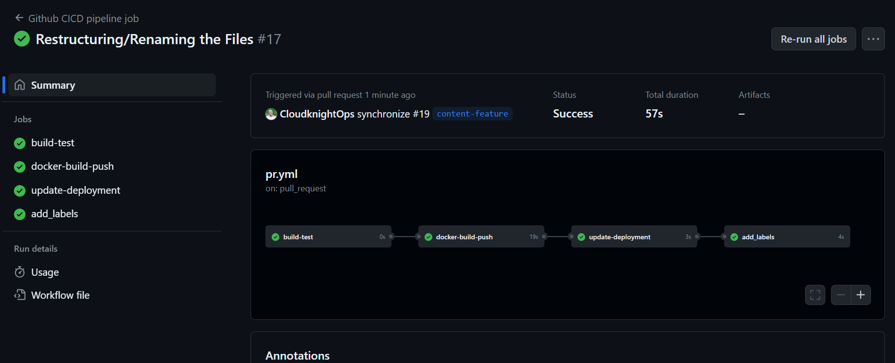

# GitOps with GitHub Actions and ArgoCD.

## Overview

This project demos a CI/CD process using GitHub Actions for continuous integration and ArgoCD for continuous deployment. The pipeline automates the build, testing, and deployment of a static web application.

## Prerequisites

- GitHub account
- DockerHub account
- Kubernetes Cluster
- ArgoCD installed in your Kubernetes cluster

### Getting Started

1. **Clone the repository:**

   ```bash
   git clone https://github.com/CloudknightOps/CICD-with-Github-action-and-Argocd.git
   cd CICD-with-Github-action-and-Argocd
   cd .github/workflows
   vi github-actions-ci-yml 


### GitHub Actions Workflow Overview

This document provides a detailed explanation of the GitHub Actions workflow defined in the YAML file named `github-cicd-pipeline.yml`. The workflow automates a Continuous Integration/Continuous Deployment (CI/CD) pipeline for a web application hosted on GitHub. The workflow is triggered on pull requests to the `master` branch.

## Workflow Structure

The workflow is organized into multiple jobs, each responsible for specific tasks in the CI/CD process.



### 1. **build-test Job**

- **Purpose:** Executes on pull requests to the `master` branch and performs initial build and test operations.

- **Steps:**
  - Echoes a message indicating that the application is being built and tested.

### 2. **docker-build-push Job**

- **Purpose:** Depends on the completion of the `build-test` job. It builds a Docker image for the web application, pushes it to DockerHub, and tags it with the commit SHA.

- **Steps:**
  - Checks out the source code using `actions/checkout`.
  - Sets up Docker Buildx for multi-platform builds.
  - Logs in to DockerHub using the provided DockerHub credentials.
  - Builds and pushes the Docker image using `docker/build-push-action`, tagging it with both `latest` and the GitHub commit SHA.

### 3. **update-deployment Job**

- **Purpose:** Depends on the completion of the `docker-build-push` job. Updates the deployment YAML file with the latest Docker image tag.

- **Steps:**
  - Retrieves the Docker image tag from the output of the previous job.
  - Checks out the code and pulls the latest changes from the pull request branch.
  - Sets file permissions for the deployment YAML file.
  - Updates the deployment YAML file with the new Docker image tag using `sed`.
  - Commits the changes with a commit message indicating the image tag update.
  - Pushes the changes back to the pull request branch.

### 4. **add_labels Job**

- **Purpose:** Depends on the completion of the `update-deployment` job. Adds the "preview" label to the associated pull request.

- **Steps:**
  - Checks out the repository using `actions/checkout`.
  - Adds the "preview" label to the pull request using `actions-ecosystem/action-add-labels`.

This GitHub Actions workflow automates the entire CI/CD pipeline, including building and testing the application, Dockerizing the application, updating the deployment configuration, and adding a label to indicate that the changes are ready for preview. It is designed to enhance the development workflow by providing automated testing and deployment processes.


Reference Image 

### Step 2 Deploy the Argocd manifest in your K8S Cluster 

```bash
   git clone https://github.com/CloudknightOps/CICD-with-Github-action-and-Argocd.git
   cd CICD-with-Github-action-and-Argocd
   cd vi deploy-argocd.yml 
```

The ArgoCD application file (deploy/application.yml) configures ArgoCD to track this repository. It specifies the source repository, target revision, path to deployment files, and the destination Kubernetes namespace watch.

  ```yaml
apiVersion: argoproj.io/v1alpha1
kind: Application
metadata:
  name: cloudknight-argo-application
  namespace: argocd 
spec:
  project: default
  source:
    repoURL: https://github.com/CloudknightOps/CICD-with-Github-action-and-Argocd
    targetRevision: HEAD
    path: deploy
  destination:
    server: https://kubernetes.default.svc
    namespace: cloudknight-ops
  syncPolicy:
    syncOptions:
    - CreateNamespace=true
    automated:
      selfHeal: true
      prune: true
```
This configuration ensures that the specified GitHub repository is tracked, and changes trigger automated deployment to the specified Kubernetes cluster and namespace using ArgoCD.


## Conclusion 

In conclusion, this CI/CD pipeline using GitHub Actions and ArgoCD provides a seamless and automated workflow for building, testing, and deploying a static web application. GitHub Actions efficiently handles the CI part, automating tasks from initial build to Docker image creation, while ArgoCD takes care of continuous deployment to a Kubernetes cluster.

The GitHub Actions workflow is well-structured, comprising jobs that cover testing, Docker image creation, deployment updates, and pull request labeling. This setup ensures a streamlined and effective development process.

ArgoCD integration further strengthens the pipeline, automating deployment processes and maintaining consistency across the Kubernetes cluster. The provided ArgoCD configuration file makes it easy to track and deploy changes from the GitHub repository.


